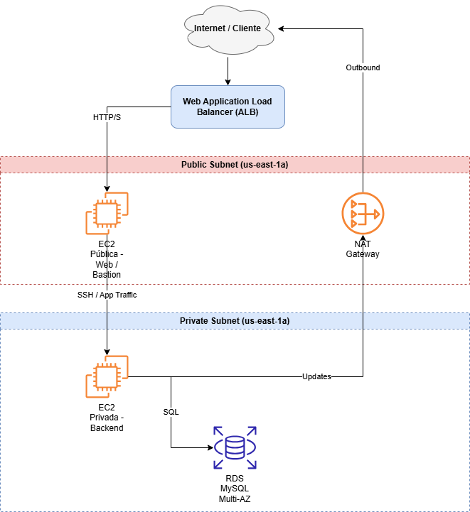

# 🏗️ Laboratorio AWS SAA – Arquitectura 3 Capas

## 📌 Descripción del proyecto

Este proyecto simula un **entorno de producción realista** en AWS, diseñado para practicar y demostrar competencias de **AWS Certified Solutions Architect – Associate**.  
Se despliega una arquitectura **3 capas**:

- **Frontend público:** EC2 públicas con Nginx detrás de un Application Load Balancer (ALB).  
- **Backend privado:** EC2 privadas que procesan la lógica de negocio.  
- **Base de datos:** RDS MySQL Multi-AZ en subred privada, con acceso seguro gestionado mediante **AWS Secrets Manager**.

💡 **Caso realista:**  
Imagina que eres un arquitecto cloud en una startup de e-commerce. Necesitas que la aplicación web sea **alta disponibilidad, segura y escalable**. Los clientes acceden al sitio, el ALB distribuye el tráfico, los servidores privados manejan la lógica de pedidos, y la base de datos almacena información sensible de usuarios y productos sin estar expuesta a Internet.

---

## 📊 Arquitectura



**Explicación de los elementos:**

- **Internet / Cliente:** Usuarios finales acceden a la aplicación.  
- **ALB:** Distribuye tráfico HTTP/HTTPS entre EC2 públicas y verifica la salud de cada instancia.  
- **Subredes públicas:** Contienen EC2 públicas y ALB; acceso directo a Internet.  
- **EC2 públicas:** Servidores web / bastion host; permiten acceso externo y administración del backend.  
- **Subredes privadas:** Contienen EC2 privadas y RDS; no tienen acceso directo a Internet.  
- **EC2 privadas:** Servidores que procesan la lógica de negocio.  
- **RDS Multi-AZ:** Base de datos replicada en varias AZ; solo accesible desde backend.  
- **NAT Gateway:** Permite que instancias privadas accedan a Internet de forma segura (actualizaciones, APIs externas).

---

## 🖼️ Capturas del laboratorio

- **EC2 pública (Web/Bastion):**  


- **EC2 privada (Backend):**  


- **Application Load Balancer:**  


- **RDS Multi-AZ:**  


---

## ⚙️ Scripts y comandos útiles

- **Conexión a EC2 pública y privada:** `scripts/connect-ec2.sh`  
- **Conexión a RDS con Secrets Manager:** `scripts/connect-rds.sh`  
- **Instalación de Nginx en EC2 pública:** `scripts/setup-nginx.sh`

**Ejemplo de conexión a RDS desde backend:**

```bash
mysql -h <RDS_ENDPOINT> -u jorge -p"<RDS_PASSWORD>" --ssl-mode=VERIFY_IDENTITY --ssl-ca=./global-bundle.pem

✅ Buenas prácticas aplicadas

-Seguridad:
Security Groups estrictos: SSH solo desde IP del administrador, HTTP solo a EC2 públicas
IAM roles y Secrets Manager para gestión de credenciales

-Alta disponibilidad:
ALB distribuye tráfico entre varias AZ
RDS Multi-AZ para tolerancia a fallos

-Redes:
Subredes públicas para frontend y NAT Gateway para tráfico saliente desde privadas
Subredes privadas para backend y RDS sin acceso directo desde Internet
